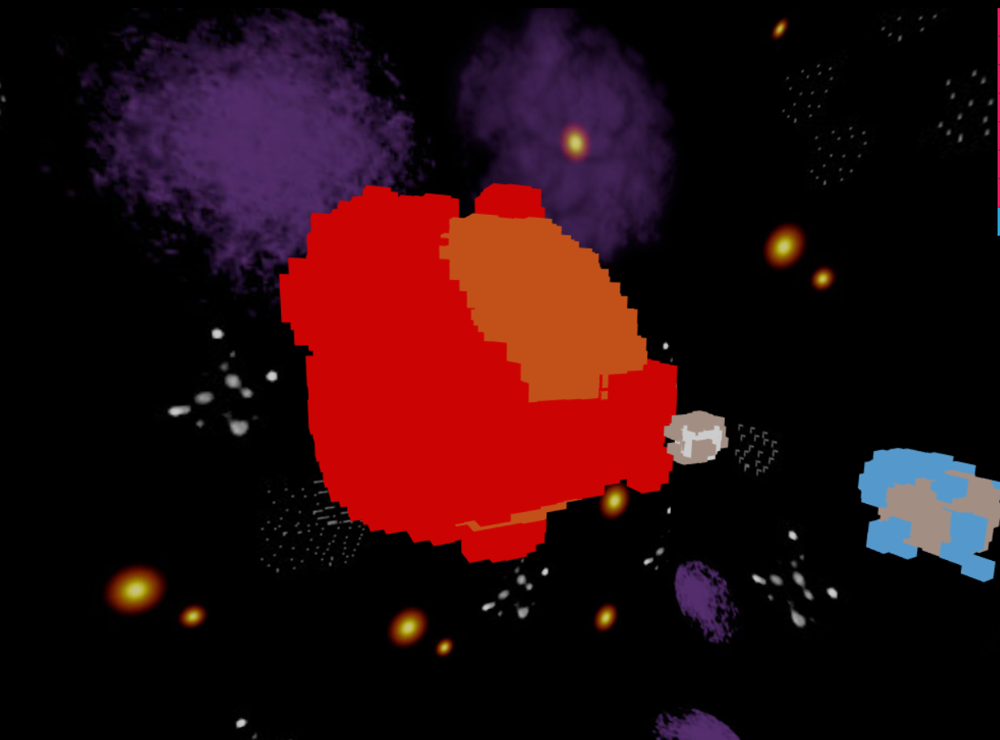
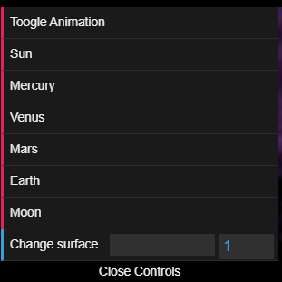

# Progetto
il progetto consiste nel realizzare un modello del sistema solare interno in stile voxel  
per la realizzazione si è diviso il pianeta in 2 parti diverse, la sfera e la superficie.
la sfera è generata a partire dal diametro, mentre la superficie è generata partendo da una heightmap. 
Si può vedere i pianeti orbitare intorno al sole.
 
## Funzionalità
 
- Toogle animation: permette di eseguire o fermale l'animazione dei pianeti
- i nomi dei corpi celesti: lo imposta come target della telecamera (orbit controller) e del comando "change surface"
- change surface: permette di ricalcolare la superficie del pianeta cambiando il raggio massimo di creazione dei cubi.